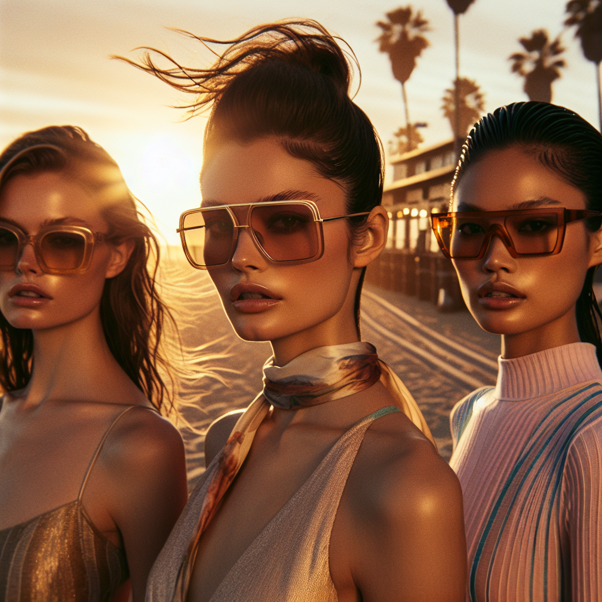

# 🕶️ Summer Sunglasses Campaign – Executive Summary

## 📊 Refined Trend Insights
Executive Summary  
As we prepare to launch our Summer 2025 eyewear campaign, three distinct silhouette narratives dominate both runway and street style: oversized aviators, cat-eye Y2K glam, and sporty wraparound shields. By featuring one standout SKU from each trend, we ensure broad market appeal—from timeless elegance to performance-driven fashion—while capitalizing on consumer demand for novelty and functionality.

1. Market Trends for Summer 2025  
• Oversized Aviator/Bug-Eye Frames  
  – Seen on Loewe and Victoria Beckham runways, these super-sized teardrop shapes blend classic pilot styling with a bold, bug-eye presence.  
• Cat-Eye/Y2K-Glam Silhouettes  
  – A fusion of ’50s Hollywood elegance and ’90s “cool girl” attitude, these upswept frames often feature subtle temple accents for a refined yet edgy look.  
• Sporty Wraparound Shields  
  – Single-lens shields and wraparounds in ultralight, technical materials deliver both high-performance utility and futuristic flair, perfect for active lifestyles.

2. In-Catalog Recommendations  
SG001 – Aviator  
  Why It Works: Enlarged teardrop lenses and a slender metal frame embody the oversized aviator revival, offering universal appeal and strong shelf presence.  

SG003 – Mystique (Cat-Eye)  
  Why It Works: Dramatic upsweep and nuanced temple detailing capture the Y2K-meets-’50s cat-eye trend, making a standout fashion statement for style-driven consumers.  

SG004 – Sport  
  Why It Works: A wraparound, single-lens design with ergonomic rubber grips meets the demand for athleisure-inspired eyewear—ideal for beach activities, festivals, and beyond.

3. Strategic Rationale  
By spotlighting these three silhouettes, our campaign addresses the full spectrum of Summer ’25 consumer interests—heritage luxury, fashion-forward expression, and performance functionality. This balanced assortment maximizes reach, drives cross-segment engagement, and reinforces our leadership in trend-driven eyewear innovation.

## 🎯 Campaign Visual

    

## ✍️ Campaign Quote
Sun-kissed silhouettes: oversized aviators for limitless summer style

## ✅ Why This Works
This phrase evokes the golden-hour beach mood of the image, spotlights the oversized aviator trend leading Summer ’25, and promises boundless, fashionable summer appeal.

---

*Report generated on 2025-12-18*
