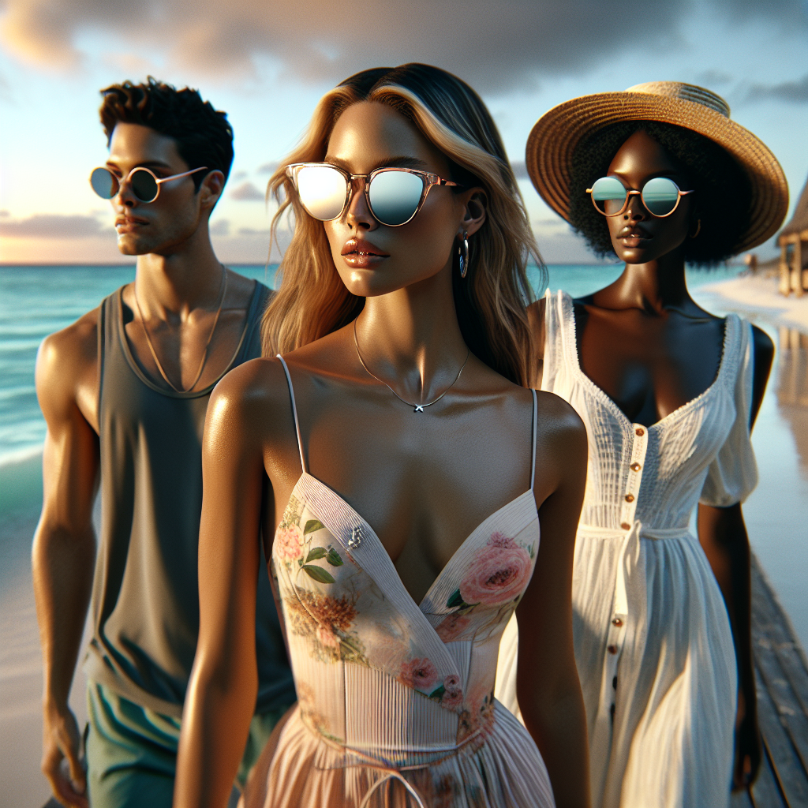

# 🕶️ Summer Sunglasses Campaign – Executive Summary

## 📊 Refined Trend Insights
Executive Summary  
As we plan our Summer 2025 eyewear campaign, three defining trends have emerged—Futuristic Wraparound Shields, Cat-Eye Revival and Colorful Tinted Lenses. By spotlighting in-stock styles SG004 Sport, SG003 Mystique and SG005 Round, we can capitalize on these high-momentum looks while keeping production and merchandising efficient.

Key Trends  
• Futuristic Wraparound Shields  
  A single-lens, streamlined silhouette that evokes high-performance athleticism and forward-leaning design.  
• Cat-Eye Revival  
  A modern take on 1950s glamour, featuring subtle embellishments and upswept corners for a refined, feminine statement.  
• Colorful Tinted Lenses  
  Bold pastels and color-block lenses paired with minimalist or transparent frames, perfect for vibrant, Instagram-ready styling.

Selected In-House Styles  
• SG004 “Sport” (Futuristic Shields)  
  Rubber-gripped, single-lens construction with lightweight flexibility—ideal for active consumers seeking a luxe-tech aesthetic.  
• SG003 “Mystique” (Cat-Eye Revival)  
  Delicate upsweep and feminine contours that seamlessly pair with seasonal prints and elegant summer dresses.  
• SG005 “Round” (Colorful Tints)  
  Slim, circular frames serving as a clean canvas for our signature pastel and bold-hue lenses (millennial pink, mint green, amber).

Campaign Rationale  
By featuring SG004, SG003 and SG005, we address the top three Summer 2025 eyewear conversations—sporty shields, statement cat-eyes and vivid tinted lenses—while leveraging in-stock inventory for rapid turnaround. This strategic alignment ensures strong visual impact, maximizes social-media shareability and drives sales momentum throughout the summer season.

## 🎯 Campaign Visual

    

## ✍️ Campaign Quote
Summer Radiance in Sport Shields, Retro Cat-Eyes, and Color Tints

## ✅ Why This Works
This line elegantly calls out the three key 2025 trends—futuristic wraparound shields, cat-eye glamour, and vibrant tinted lenses—while evoking the sunlit beach stroll and effortless style showcased by the trio in the image.

---

*Report generated on 2025-12-18*
